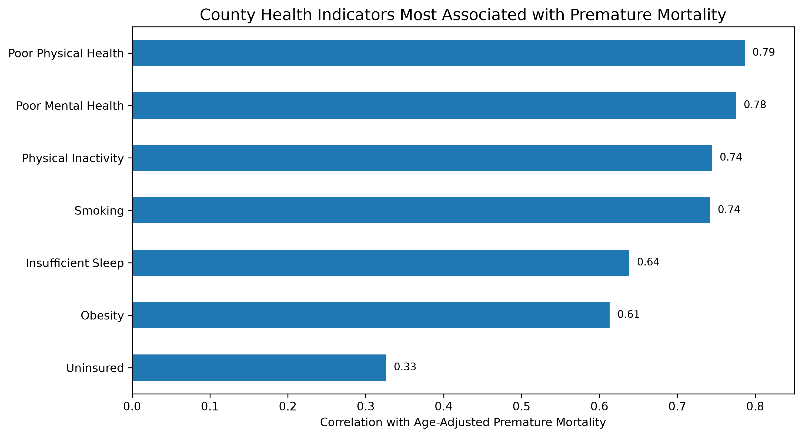
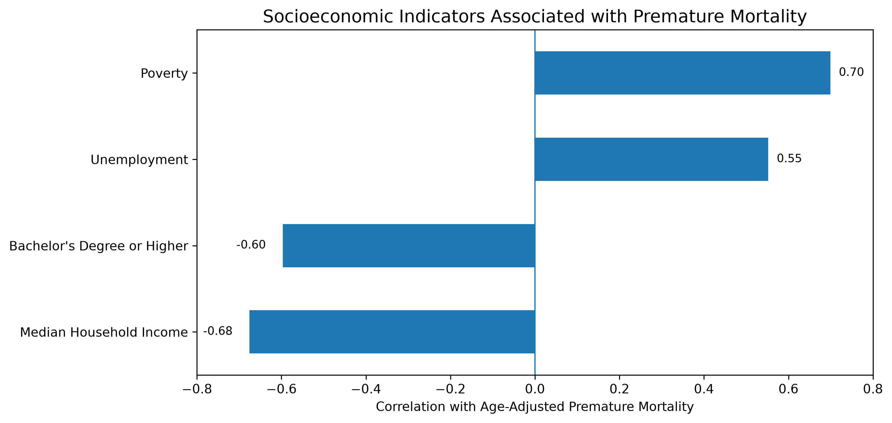
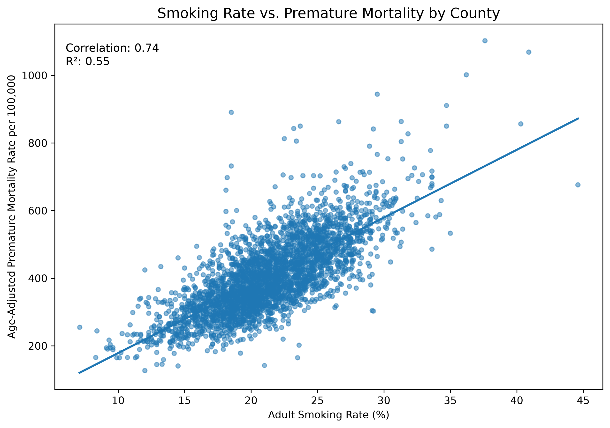
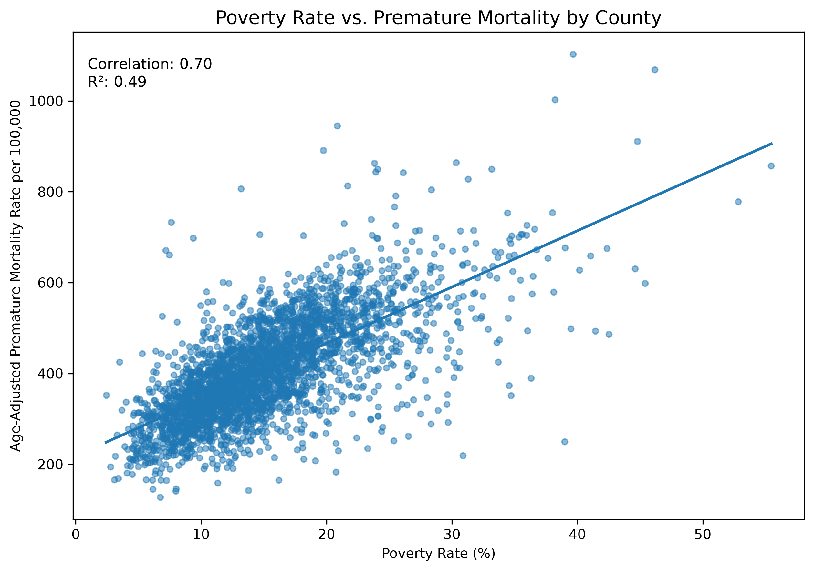
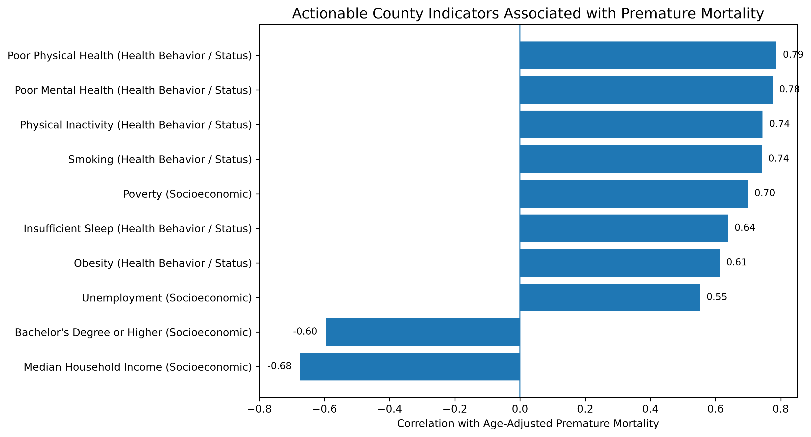
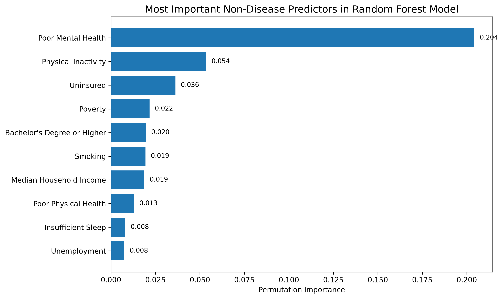

# Preventable Death Map

A county-level data analytics project exploring which health, behavioral, and socioeconomic indicators are most associated with premature mortality across U.S. counties.

## Project Question

Which county-level indicators are most strongly associated with premature mortality in the United States?

This project analyzes whether premature mortality across U.S. counties can be understood through a combination of:

- Health behavior and health-status indicators
- Socioeconomic conditions
- Disease-burden context
- Predictive modeling using non-disease indicators

The main outcome is **age-adjusted premature mortality rate** for deaths under age 75 during the 2015–2019 pre-COVID baseline period.

## Why This Project Matters

Premature mortality is not distributed randomly across the United States. This project investigates whether counties with higher premature death rates share measurable patterns in health behavior, mental health, poverty, education, income, insurance access, and chronic disease burden.

The goal is not to prove individual-level causation. The goal is to identify county-level risk patterns using public data and build a reproducible analytics workflow.

## Data Sources

| Source | Dataset | Role in Project |
|---|---|---|
| CDC WONDER | 2015–2019 Multiple Cause of Death county mortality data | Primary outcome: premature mortality |
| CDC PLACES | 2020 county health behavior and chronic disease estimates | Health behavior, health-status, and disease-burden predictors |
| U.S. Census ACS | 2019 ACS 5-year county socioeconomic indicators | Poverty, income, education, and unemployment predictors |

## Final Analysis Dataset

The main analysis file is:

`data/processed/mortality_places_acs_merged_2015_2020.csv`

A Power BI-ready version is available here:

`dashboard/power_bi_county_mortality_dataset.csv`

The Power BI-ready dataset contains 3,132 county rows and 25 cleaned dashboard fields.

## Key Findings

### 1. Health behavior and health-status indicators are strongly associated with premature mortality

The strongest non-disease health indicators were:

| Indicator | Correlation with Premature Mortality |
|---|---:|
| Poor Physical Health | 0.79 |
| Poor Mental Health | 0.78 |
| Physical Inactivity | 0.74 |
| Smoking | 0.74 |
| Insufficient Sleep | 0.64 |
| Obesity | 0.61 |

Counties with worse reported physical health, worse mental health, higher smoking, and higher physical inactivity tend to have higher premature mortality.



### 2. Socioeconomic disadvantage is strongly associated with premature mortality

The strongest socioeconomic relationships were:

| Indicator | Correlation with Premature Mortality |
|---|---:|
| Poverty Rate | 0.70 |
| Median Household Income | -0.68 |
| Bachelor's Degree or Higher | -0.60 |
| Unemployment Rate | 0.55 |

Counties with higher poverty and unemployment tend to have higher premature mortality. Counties with higher income and higher educational attainment tend to have lower premature mortality.



### 3. Poverty and smoking both show strong county-level patterns

Poverty rate and smoking rate each show strong positive relationships with premature mortality.

| Relationship | Correlation | R² |
|---|---:|---:|
| Smoking Rate vs. Premature Mortality | 0.74 | 0.55 |
| Poverty Rate vs. Premature Mortality | 0.70 | 0.49 |





### 4. The strongest actionable indicators combine health and socioeconomic factors

Disease-burden variables such as coronary heart disease, stroke, COPD, diabetes, and high blood pressure are strongly associated with premature mortality, but they are closely related to the mortality outcome itself.

For a less circular view, this project separates out actionable non-disease indicators.



### 5. Non-disease indicators can predict county premature mortality

A predictive modeling step tested whether non-disease indicators could estimate county-level premature mortality.

The model excluded disease-burden indicators to avoid an overly circular result.

| Model | Test R² | Test MAE | Test RMSE |
|---|---:|---:|---:|
| Linear Regression | 0.66 | 46.08 | 62.44 |
| Random Forest | 0.72 | 42.01 | 56.54 |

The Random Forest model explained about **72% of test-set variation** in county-level premature mortality using only non-disease health, behavior, access, and socioeconomic predictors.

### 6. Poor mental health was the strongest non-disease model signal

In the Random Forest model, the strongest non-disease predictors were:

| Predictor | Random Forest Permutation Importance |
|---|---:|
| Poor Mental Health | 0.204 |
| Physical Inactivity | 0.054 |
| Uninsured | 0.036 |
| Poverty | 0.022 |
| Bachelor's Degree or Higher | 0.020 |
| Smoking | 0.019 |
| Median Household Income | 0.019 |

Poor mental health should be interpreted as the strongest non-disease warning signal in the model, not as proof that mental health alone causes premature mortality.



## Methodology

### 1. Data Acquisition

Downloaded county-level mortality, health, and socioeconomic data from public sources.

Notebook:

`notebooks/01_data_acquisition.ipynb`

### 2. Data Cleaning

Cleaned CDC WONDER mortality data, preserved CDC unreliable-rate flags, and standardized county FIPS codes.

Notebook:

`notebooks/02_data_cleaning.ipynb`

### 3. Data Merging

Merged mortality data with CDC PLACES and ACS data using county FIPS codes.

Two county/FIPS updates were required because of county name/FIPS changes:

| Original FIPS | Original County Name | Updated FIPS | Updated County Name |
|---|---|---|---|
| 02270 | Wade Hampton Census Area, AK | 02158 | Kusilvak, AK |
| 46113 | Shannon County, SD | 46102 | Oglala Lakota, SD |

After applying this crosswalk, the merged dataset had 0 missing CDC PLACES matches and 0 missing ACS matches.

### 4. Exploratory Analysis

Calculated correlations between premature mortality and health, disease-burden, and socioeconomic predictors.

Notebook:

`notebooks/03_exploratory_analysis.ipynb`

### 5. Predictive Modeling

Built linear regression and random forest models using non-disease predictors only.

Notebook:

`notebooks/04_predictive_modeling.ipynb`

## Repository Structure

```text
preventable-death-map/
├── dashboard/
│   ├── README.md
│   └── power_bi_county_mortality_dataset.csv
├── data/
│   ├── raw/
│   ├── processed/
│   ├── data_dictionary.md
│   └── data_source_tracker.md
├── notebooks/
│   ├── 01_data_acquisition.ipynb
│   ├── 02_data_cleaning.ipynb
│   ├── 03_exploratory_analysis.ipynb
│   └── 04_predictive_modeling.ipynb
├── report/
│   └── initial_findings.md
├── visuals/
│   └── charts/
├── README.md
└── requirements.txt
